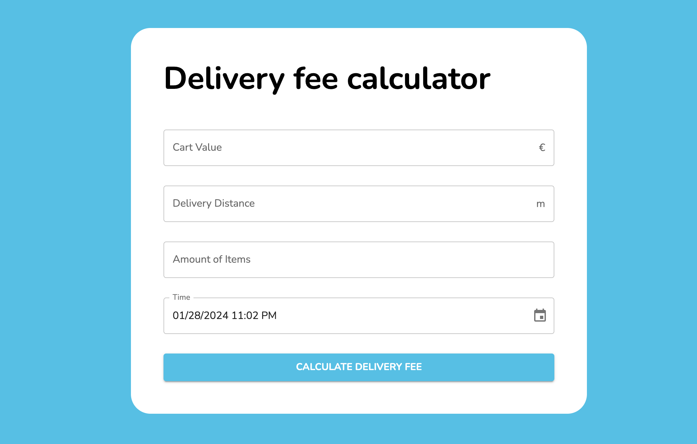

# Wolt summer intern assignment


## Run the app

Run the following command to install all dependencies:

```bash
npm install
```

Run the following command to start the development server:

```bash
npm start
```

## Run automated tests

```bash
npm run test
```

## Technologies used

- [Create React App](https://create-react-app.dev/) - for project setup
- [React](https://reactjs.org/) - UI Library for building user interfaces
- [TypeScript](https://www.typescriptlang.org/) - extends JavaScript by adding types to the language
- [Material UI](https://mui.com/) - UI component library
- [Dayjs](https://day.js.org/) - JavaScript library that parses, validates, manipulates, and displays dates and times

In this test assignment, I used the Material UI to make the design beautiful and clean. I used the Text Field, Button, and DatePicker components for the calendar, so I like the UI solution of these libraries. It also allowed me to work faster because I didn't have to create my own design components. I can also create components and functionality without using libraries. However, in this project, using the Material UI seems to be a more practical and effective solution.

## Specifications

Rules for calculating a delivery fee

If the cart value is less than 10€, a small order surcharge is added to the delivery price. The surcharge is the difference between the cart value and 10€. For example if the cart value is 8.90€, the surcharge will be 1.10€.
A delivery fee for the first 1000 meters (=1km) is 2€. If the delivery distance is longer than that, 1€ is added for every additional 500 meters that the courier needs to travel before reaching the destination. Even if the distance would be shorter than 500 meters, the minimum fee is always 1€.
Example 1: If the delivery distance is 1499 meters, the delivery fee is: 2€ base fee + 1€ for the additional 500 m => 3€
Example 2: If the delivery distance is 1500 meters, the delivery fee is: 2€ base fee + 1€ for the additional 500 m => 3€
Example 3: If the delivery distance is 1501 meters, the delivery fee is: 2€ base fee + 1€ for the first 500 m + 1€ for the second 500 m => 4€
If the number of items is five or more, an additional 50 cent surcharge is added for each item above and including the fifth item. An extra "bulk" fee applies for more than 12 items of 1,20€
Example 1: If the number of items is 4, no extra surcharge
Example 2: If the number of items is 5, 50 cents surcharge is added
Example 3: If the number of items is 10, 3€ surcharge (6 x 50 cents) is added
Example 4: If the number of items is 13, 5,70€ surcharge is added ((9 _ 50 cents) + 1,20€)
Example 5: If the number of items is 14, 6,20€ surcharge is added ((10 _ 50 cents) + 1,20€)
The delivery fee can never be more than 15€, including possible surcharges.
The delivery is free (0€) when the cart value is equal or more than 200€.
During the Friday rush, 3 - 7 PM, the delivery fee (the total fee including possible surcharges) will be multiplied by 1.2x. However, the fee still cannot be more than the max (15€). Considering timezone, for simplicity, use UTC as a timezone in backend solutions (so Friday rush is 3 - 7 PM UTC). In frontend solutions, use the timezone of the browser (so Friday rush is 3 - 7 PM in the timezone of the browser).

## Screenshots

Default delivery fee calculator


Delivery fee calculator after calculating


Error notification when user enters invalid input

